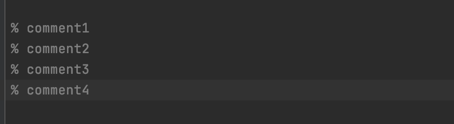

__Prolog-swi__ learner support for IntelliJ family  
***
> Basic prolog syntax analysis  

The plugin has its parser and lexer to give you hints when the code you write doesn't follow the prolog syntax
> Highlighter for predicates/ predicates reference, atom, constant....  

> Go to implementation  

right click on referenced predicate name to see its implementation or hold command/ctrl + click the referenced predicate name.  
the plugin will identify the predicates *with the different amount of parameters* and navigate to the predicate which has same parameter numbers as you chose.
> Commenter 

batch commenter, select lines and hold command/ctrl + "/" 
> Auto formatting</ul>  

this helps you add spaces around UNIFY and other operators and indent composed predicated to make your code looks pretty